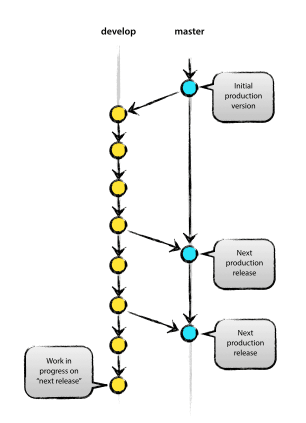
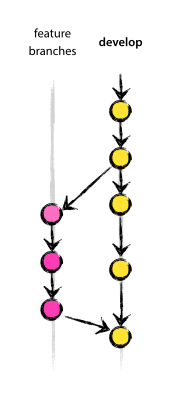
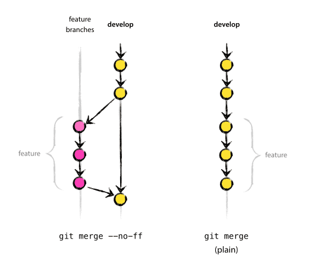

# SWC

## Requirements

- Java JDK 1.8 
- Maven 3.5.4+
- Tomcat 8+

## Installation

### Pre-requistes (Windows)

- Unzip k:\swc\swcalculator_home.zip to local C:\swcalculator_home

- Install Java JDK 1.8
	- set Enviroment variable JAVA_HOME="Java JDK installed directory"
	- append %JAVA_HOME%\bin to PATH
	- set Enviroment variable JAVA_OPTS=-Djava.library.path="C:\Apps\apache-tomcat-9.0.12\webapps\swcalculator-server\WEB-INF\classes" -DSWCALCULATOR_HOME="c:\swcalculator_home"

- Install Maven
	- set Enviroment variable MVN_HOME="Maven installed directory"
	- append %MVN_HOME%\bin to PATH

- Install Tomcat8

- ### Local Development Environment Setup (Windows)

	- Install Eclipse or IntelliJ or any other Java IDE
	- Clone this repository to your computer: git clone https://github.com/Eastern-Research-Group/SWC_NT.git
	- Navigate to  swcalculator-server
	- Run mvn clean compile install
	- copy .war file from swcalculator-server\target folder to {Tomcat8}\webapps folder
	- Navigate to FrontEnd folder
	- Run jar -cf stormwatercalculater.war -C stormwatercalculater .
	- copy stormwatercalculater.war to {Tomcat8}\webapps folder

- ## Git Branching
	 
The central repo holds two main branches

	master
	develop
		

		
origin/master is main branch where the source code of HEAD always reflects a production-ready state, commit to master restricted.
	
origin/develop is the main branch where the source code of HEAD always reflects a state with the latest delivered development changes for the next release, direct commit to develop is discouraged and in some cases restricted. This is where any automatic nightly builds are built from.

When the source code in the develop branch reaches a stable point and is ready to be released, all of the changes should be merged back into master either by the repository administrator or the project release manager, each time when changes are merged back into master, this is a new production release by definition. CI/CD process will automatically build and prepare the artifacts that can be deployed to production servers everytime there was a commit on master.
	
Next to the main branches master and develop, our development model uses a variety of supporting branches to aid parallel development between team members, ease tracking of features, prepare for production releases and to assist in quickly fixing live production problems. Unlike the main branches, these branches always have a limited life time, since they will be removed eventually.

The different types of branches we may use are:
	- Feature branches
	

- ### Feature branches
	
		branch off from:
			develop
		Must merge back into:
			develop
		Branch naming convention:
			anything except master, develop, feature-*
	
Feature branches (or sometimes called topic branches) are used to develop new features for the upcoming or a distant future release. When starting development of a feature, the target release in which this feature will be incorporated may well be unknown at that point. The essence of a feature branch is that it exists as long as the feature is in development, but will eventually be merged back into develop (to definitely add the new feature to the upcoming release) or discarded.

Feature branches typically exist in developer repos only, not in origin.

Creating a feature branch
 
		$ git checkout -b myfeature develop
		Switched to a new branch "myfeature"
		
Incorporating a finished feature on develop: Finished features may be merged into the develop branch to definitely add them to the upcoming release:

		$ git checkout develop
		Switched to branch 'develop'
		$ git merge --no-ff myfeature
		Updating ea1b82a..05e9557
		(Summary of changes)
		$ git branch -d myfeature
		Deleted branch myfeature (was 05e9557).
		$ git push origin develop

The --no-ff flag causes the merge to always create a new commit object, even if the merge could be performed with a fast-forward. This avoids losing information about the historical existence of a feature branch and groups together all commits that together added the feature. Compare:

	

	 

